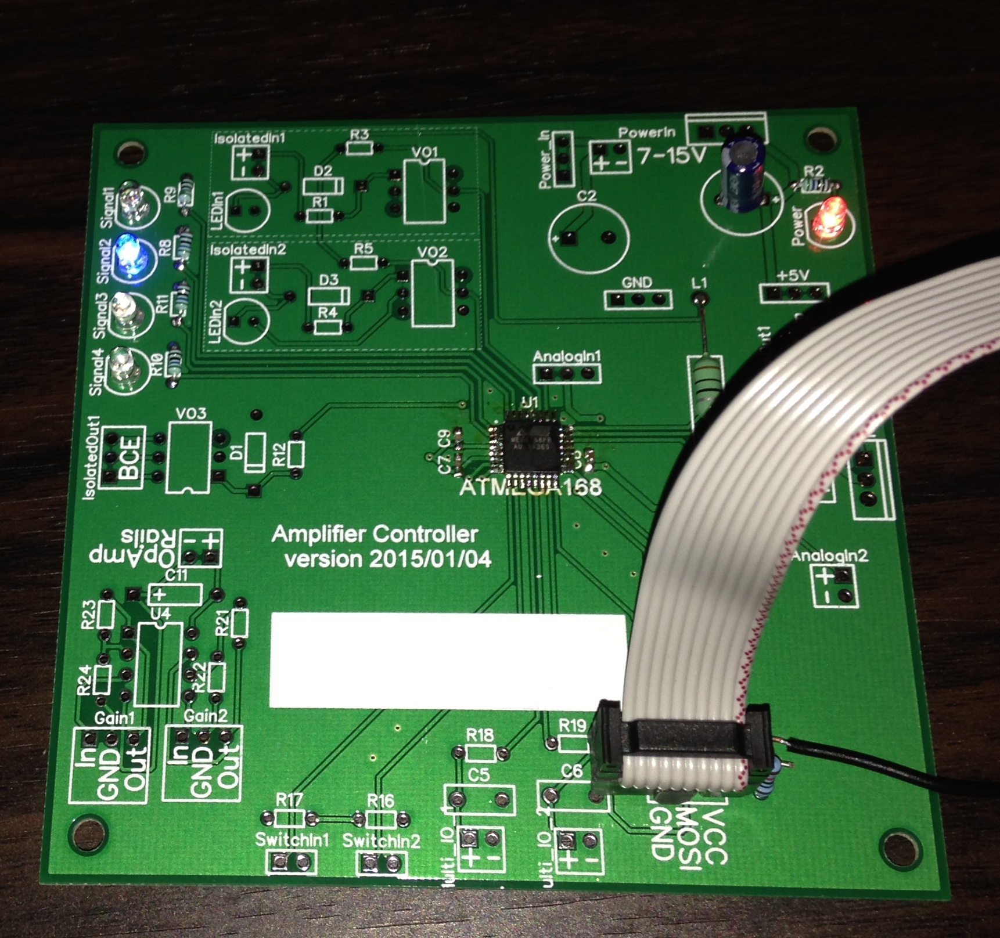

## Overview
This repo contains a design for a PCB that holds an ATMEGA microcontroller and corresponding interfaces that would be useful to control an amplifier. Some possible uses:

* Convert a surround-sound receiver into a multi-channel amplifier by removing everything except the power amplifier section and power supply. Use the outputs from this controller board to drive the power supply switching relay and any speaker protection relays. Use the inputs on this controller to interface with a thermal sensor (like the LM61CIZ used in an Onkyo TX-SR705) and a trigger input to turn on the amplifier. The ATMEGA can be programmed to drive LEDs indicating the amplifier's state, and apply delays to protect the system during startup.
* Build your own power amplifier that includes thermal management, trigger inputs/outputs, and delayed relay firing at startup for protection circuits.

Overall, this PCB is quite similar to an Arduino, but with a little extra circuitry, and not as many general I/O pins exposed as such.

Some things you'll find in the repo:
* DipTrace schematic files and PCB layouts
* PCB gerbers (both for the crossover circuit PCB and a corresponding dual-rail power supply)
* Code for the ATMega
** A simple LED blinking program
** A makefile that contains an avrdude command that can set the fuses appropriately to get the chip to run at 16Mhz on an external crystal
** My code that switches on/off the main power relay inside the Onkyo based on an input trigger signal (isolated using an opto-isolator).
* Pictures of the results

## Isaac Dooley's DIY Project

This is simply a DIY project under work by Isaac Dooley. I am no expert in these matters, but hopefully this thing will work fine.

Some known issues with the initial 2015/01/04 version:
* Silk-screened text on the PCB overlaps the pads of the ATMEGA 168.
* The PWM 1 output is connected to a non-PWM-capable pin on the ATMEGA 168. It should be moved to the unused PWM pin nearby.

My first attempt was a bit of a failures. First I set bad fuse values on the ATMEGA168, making it impossible to program it further or modify the fuse values (without a high-voltage programmer). Then I broke some pads on the PCB while trying to unsolder the chip to replace it.

The second attempt however is a success so far! I'm able to set the fuses correctly and program the ATMEGA168 to blink the 4 LEDs on the PCB. Next I'll solder on the input/output circuitry components to verify those parts work as required. Here is a photo of the functional PCB so far:

